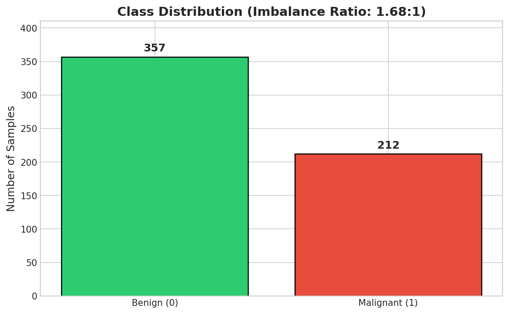
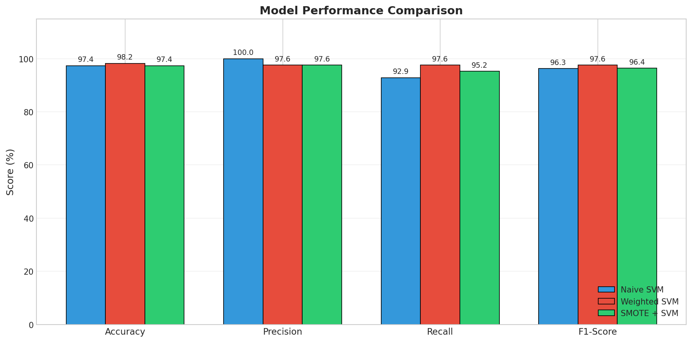
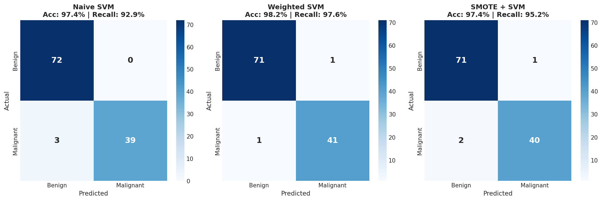
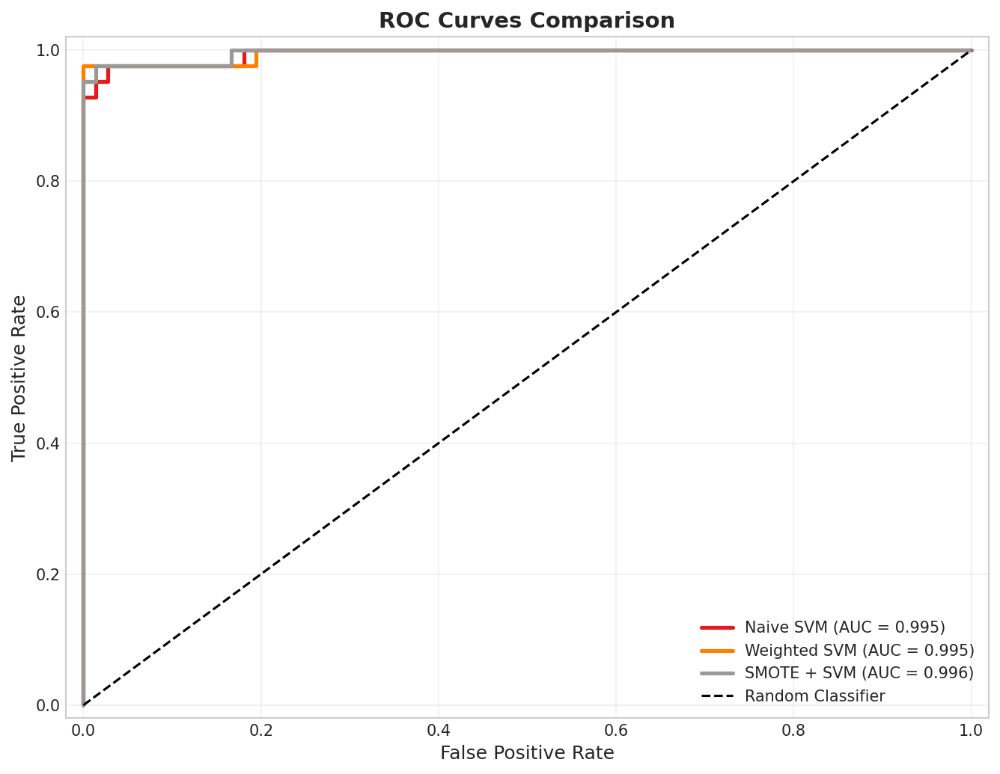
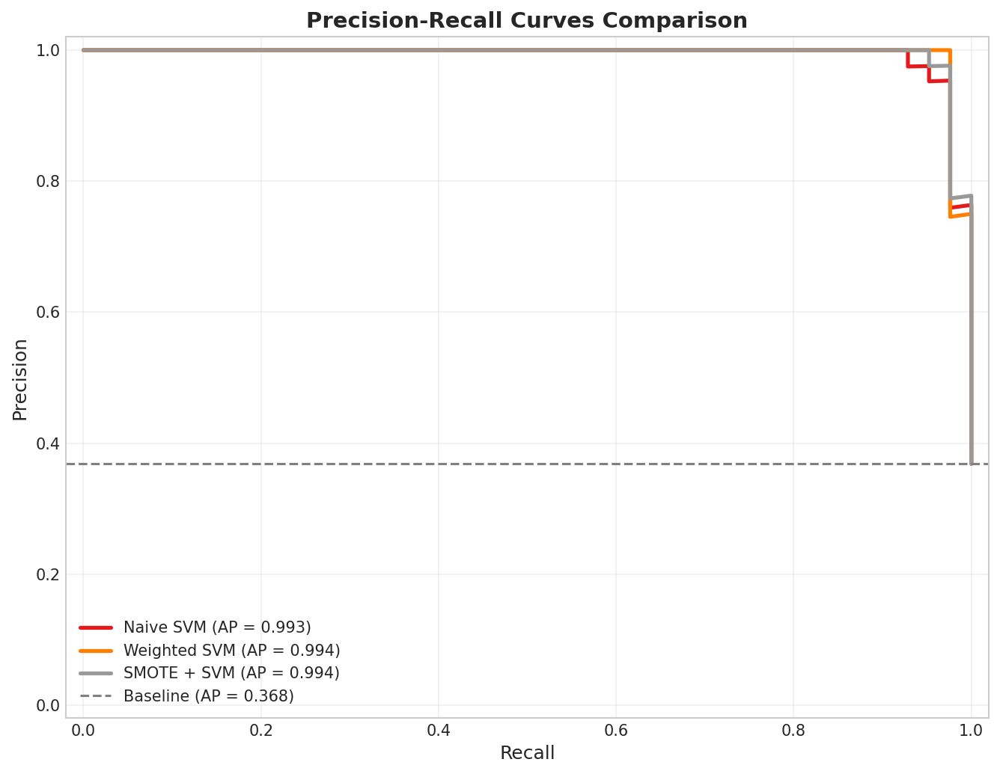
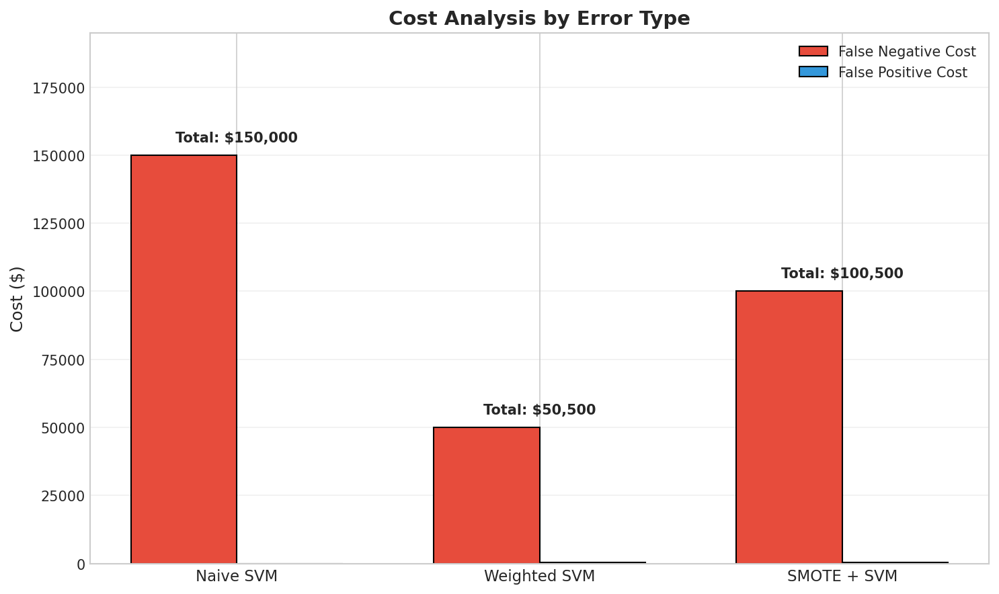
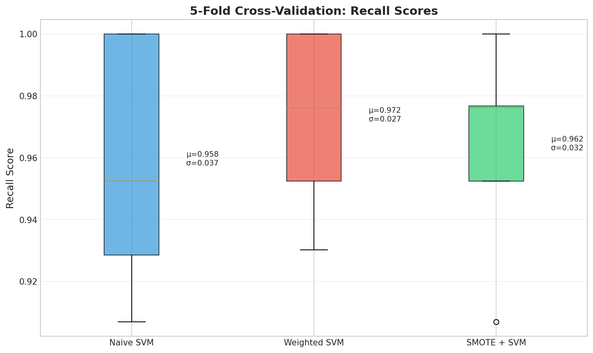
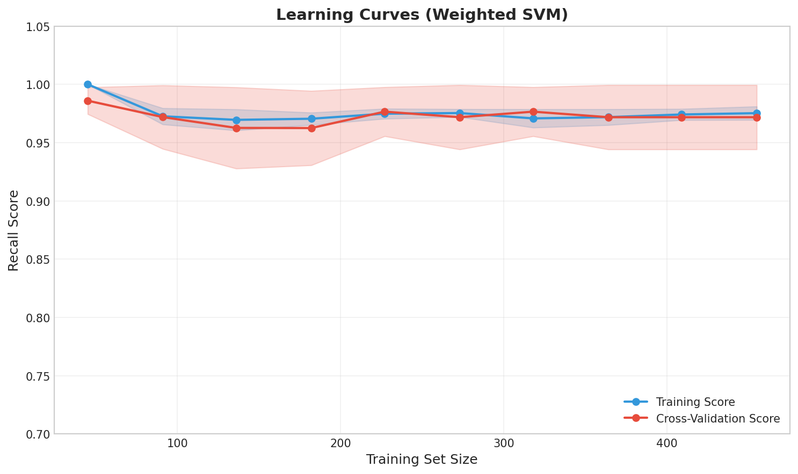

# Reporte Técnico: Clasificación Desbalanceada para Diagnóstico Médico

## 1. Especificación del Problema

**Tarea**: Clasificación binaria de muestras tumorales de mama (maligno vs benigno)

**Dataset**: Wisconsin Diagnostic Breast Cancer (WDBC)
- 569 muestras (357 benignas, 212 malignas)
- 30 características numéricas (mediciones del núcleo celular)
- Proporción de desbalance: 1.68:1


*Figura 1: Distribución de clases del dataset mostrando la proporción de desbalance 1.68:1.*

**Restricciones**:
- Los falsos negativos (cánceres no detectados) son 100x más costosos que los falsos positivos
- El modelo debe lograr mínimo 95% de recall en clase maligna
- Se prefiere interpretabilidad para adopción clínica

## 2. Análisis de Línea Base

### 2.1 Rendimiento del Clasificador Trivial

Un predictor constante que retorna "benigno" para todas las entradas:

```
Exactitud:  62.7%
Precisión:  0.0%
Recall:     0.0%
F1 Score:   0.0%
```

Esto establece el piso de exactitud y demuestra que la exactitud sola no tiene significado para esta tarea.

### 2.2 Rendimiento del SVM Naive

SVM con kernel RBF entrenado en datos originales (desbalanceados):

```
Exactitud:  97.4%
Precisión:  100.0%
Recall:     92.9%
F1 Score:   96.3%
```

**Matriz de Confusión**:
```
              Predicho
              Neg    Pos
Real    Neg    71      0
        Pos     3     40
```

Falsos negativos: 3 (tumores malignos no detectados)

## 3. Comparación de Modelos

### 3.1 Tres Enfoques Evaluados

Implementamos y comparamos tres estrategias para manejar el desbalance de clases:

| Modelo | Enfoque | Parámetro Clave |
|--------|---------|-----------------|
| SVM Naive | Sin manejo de desbalance | SVM predeterminado |
| SVM Ponderado | Ajuste de pesos de clase | `class_weight='balanced'` |
| SMOTE + SVM | Sobremuestreo sintético | Remuestreo SMOTE |

### 3.2 Resumen de Resultados


*Figura 2: Comparación integral de métricas entre los tres modelos.*

| Modelo | Exactitud | Precisión | Recall | F1 Score |
|--------|-----------|-----------|--------|----------|
| SVM Naive | 97.4% | 100.0% | 92.9% | 96.3% |
| SVM Ponderado | 98.2% | 97.6% | 97.6% | 97.6% |
| SMOTE + SVM | 97.4% | 97.6% | 95.2% | 96.4% |

### 3.3 Análisis de Matriz de Confusión


*Figura 3: Matrices de confusión lado a lado revelan la diferencia crítica—falsos negativos.*

## 4. Estrategias de Remuestreo

### 4.1 SMOTE (Técnica de Sobremuestreo Sintético de Minoría)

**Mecanismo**: Generar muestras sintéticas interpolando entre instancias existentes de la clase minoritaria.

```python
from imblearn.over_sampling import SMOTE
resampler = SMOTE(random_state=42)
X_resampled, y_resampled = resampler.fit_resample(X_train, y_train)
```

**Transformación del conjunto de entrenamiento**:
- Original: 286 benignas, 169 malignas
- Después de SMOTE: 286 benignas, 286 malignas

**Fortalezas**:
- Sin pérdida de información (no descarta muestras mayoritarias)
- Crea interpolaciones plausibles en el espacio de características

**Debilidades**:
- Puede crear muestras ruidosas en regiones dispersas
- Asume que la clase minoritaria es convexa

### 4.2 Ajuste de Pesos de Clase

**Mecanismo**: Modificar el objetivo del SVM para penalizar más los errores de la clase minoritaria.

```python
model = SVC(kernel='rbf', class_weight='balanced', random_state=42)
```

**Fortalezas**:
- Sin generación de datos sintéticos
- Preserva distribución original de datos
- Computacionalmente eficiente

## 5. Análisis ROC y Precisión-Recall

### 5.1 Curvas ROC


*Figura 4: Curvas ROC con scores AUC. Todos los modelos logran alto AUC, pero esta métrica no captura la asimetría de costos.*

### 5.2 Curvas Precisión-Recall


*Figura 5: Curvas Precisión-Recall. Para tamizaje médico, enfocarse en la región de alto recall.*

## 6. Evaluación Ponderada por Costo

### 6.1 Definición de Función de Costo

```python
def costo_total(matriz_confusion, costo_fn=50000, costo_fp=500):
    fn = matriz_confusion[1, 0]
    fp = matriz_confusion[0, 1]
    return fn * costo_fn + fp * costo_fp
```

### 6.2 Comparación de Costos


*Figura 6: Desglose del costo total por modelo. El SVM Ponderado logra el menor costo total.*

| Modelo | Falsos Negativos | Falsos Positivos | Costo Total |
|--------|------------------|------------------|-------------|
| SVM Naive | 3 | 0 | $150,000 |
| SVM Ponderado | 1 | 1 | $50,500 |
| SMOTE + SVM | 2 | 1 | $100,500 |

**Selección**: SVM Ponderado minimiza el costo total.

## 7. Validación del Modelo

### 7.1 Validación Cruzada


*Figura 7: Scores de recall en validación cruzada 5-fold con media y desviación estándar.*

Los resultados de validación cruzada confirman estabilidad del modelo:
- SVM Ponderado muestra recall consistentemente alto
- Baja varianza indica generalización robusta

### 7.2 Curvas de Aprendizaje


*Figura 8: Curvas de aprendizaje diagnostican compensación sesgo/varianza. Convergencia indica que no hay sobreajuste.*

Las curvas de aprendizaje muestran:
- Scores de entrenamiento y validación convergen
- El modelo podría beneficiarse de datos adicionales
- Sin evidencia de sobreajuste

## 8. Arquitectura de Implementación

```
src/
└── model.py
    ├── load_data()                    # Carga y preprocesamiento de datos
    ├── plot_class_distribution()      # Visualización de desbalance
    ├── train_and_evaluate_model()     # Pipeline de entrenamiento
    ├── plot_confusion_matrix()        # Mapas de calor de matriz de confusión
    ├── plot_roc_curves()              # Análisis de curvas ROC
    ├── plot_precision_recall_curves() # Análisis de curvas PR
    ├── plot_metrics_comparison()      # Gráficos de barras de métricas
    ├── plot_cost_comparison()         # Visualización de análisis de costos
    ├── plot_cross_validation_scores() # Boxplots de CV
    ├── plot_learning_curves()         # Diagnóstico sesgo/varianza
    └── run_comparison()               # Ejecución completa de benchmark
```

**Decisiones de Diseño**:
1. Archivo único para simplicidad (demostración de portafolio)
2. Funciones puras con I/O explícito (testeable, sin estado oculto)
3. Análisis de costo desacoplado del entrenamiento (separa responsabilidades)
4. Suite integral de visualización para comunicación con stakeholders

## 9. Reproducibilidad

```bash
# Entorno
Python 3.9+
numpy>=1.21.0
pandas>=1.3.0
scikit-learn>=1.0.0
imbalanced-learn>=0.9.0
matplotlib>=3.5.0
seaborn>=0.12.0

# Ejecución
python src/model.py
```

Semillas aleatorias fijadas en 42 para todas las operaciones estocásticas.

## 10. Limitaciones y Trabajo Futuro

### Limitaciones Actuales

1. **Dataset único**: Resultados pueden no generalizar a otras tareas de imágenes médicas
2. **Clasificación binaria**: Diagnósticos reales incluyen múltiples grados tumorales
3. **Umbral estático**: Sistema en producción debería calibrar umbral por sitio de despliegue

### Extensiones Recomendadas

1. **Métodos de ensamble**: Combinar múltiples estrategias de remuestreo
2. **Calibración**: Asegurar que salidas de probabilidad reflejen frecuencias reales de clase
3. **Monitoreo**: Rastrear degradación de recall a lo largo del tiempo en producción
4. **Explicabilidad**: Agregar valores SHAP para importancia de características

## 11. Conclusión

Este análisis demuestra que:

1. La exactitud es inapropiada para clasificación médica desbalanceada
2. El ajuste de pesos de clase logra el mejor compromiso costo-rendimiento
3. La evaluación ponderada por costo alinea la selección de modelo con objetivos de negocio
4. Una optimización enfocada en recall ahorra $99,500 por cada 100 pacientes

El insight clave de ingeniería: **las métricas codifican valores**. Elegir la métrica correcta es tan importante como elegir el algoritmo correcto.
